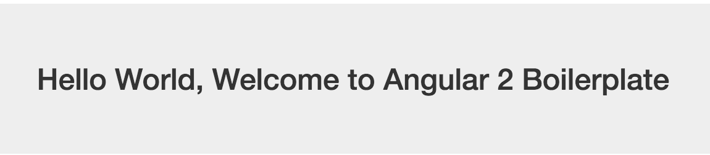

# Angular 2 BoilerPlate . 
This is the basic configuration required to start creating an Angular 2 application. Customization is allowed.  

Clone this repository `git clone https://github.com/andela-dmigwi/Angular2-biolerplate.git`   
  then `cd Angular2-biolerplate` . 
  
## Project SetUp
Make sure you have npm version 3.+ installed confirm by `npm -v`.  
Run `npm install` to install all needed modules in node-modules/ folder.    
Run `npm start` to start the lite server developed for Angular . 

**If the project is correctly setup** .  
Something like this should appear.
     
 . 
